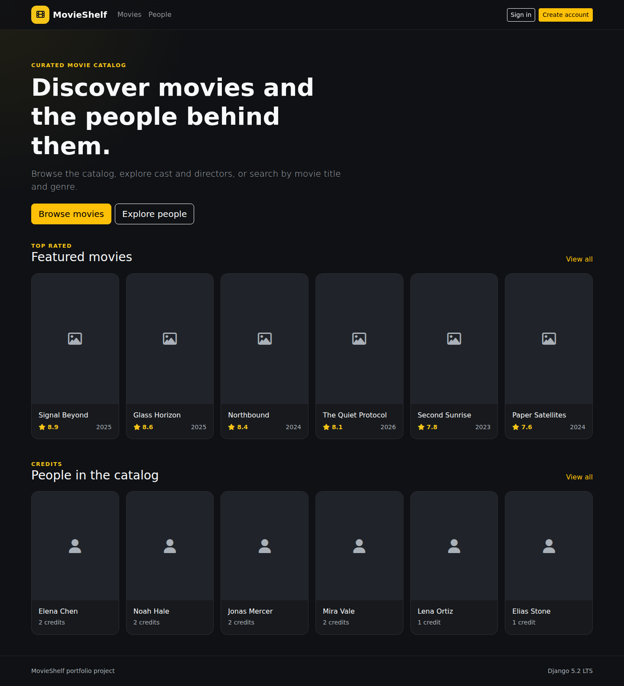
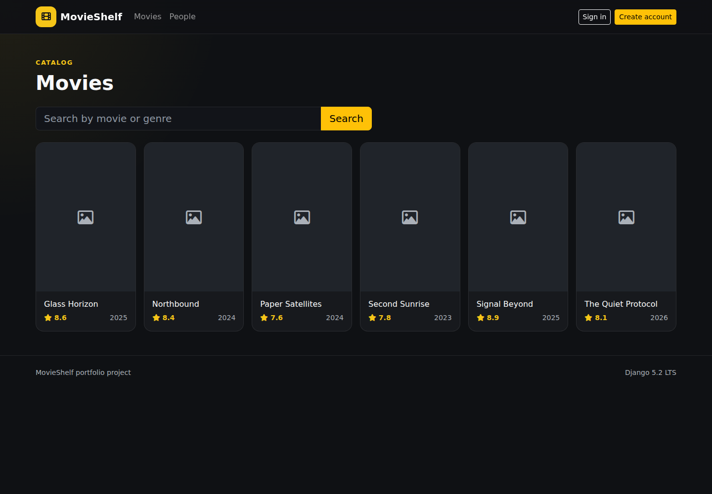
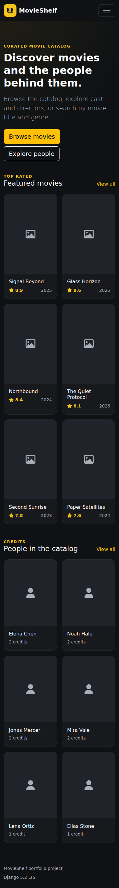

# MovieShelf

[](https://github.com/MykolaDotsenko/DjangoMovieProject/actions/workflows/ci.yml)


**A modern Django movie catalog focused on clean backend architecture, secure authentication, relational data integrity, and reliable engineering practices.**

MovieShelf lets users browse movies, genres, cast and directors, search the catalog, explore filmographies, and create accounts through Django's built-in authentication system.

## Screenshots

### Desktop home



### Movie catalog



### Mobile



> Screenshots are captured from the real Django application running with the included fictional demo fixture.

## Highlights

- **Django 5.2 LTS** with a clean `config/` + application structure
- relational modeling for movies, genres, people, and participation roles
- database-level constraints for ratings, durations, unique genres, and duplicate credits
- PostgreSQL ranked full-text search with web-style queries, plus partial title/genre matching
- movie detail pages with cast, directors, genres, ratings, trailers, and metadata
- people directory with filmography
- Django-native sign up, sign in, password validation, redirect-after-login, and CSRF-protected sign out
- responsive server-rendered UI with **Bootstrap 5.3.8**
- strict environment parsing with fail-fast production settings
- SQLite for zero-friction local use and PostgreSQL verified in CI
- database-backed `/health/` readiness endpoint
- console logging with environment-controlled log level
- deterministic fictional demo data via a Django fixture
- Ruff, format checks, migration checks, dependency auditing, coverage, deployment checks, and Dependabot
- Playwright browser flows and axe WCAG A/AA accessibility checks on desktop and mobile
- Gunicorn + WhiteNoise production configuration
- CI verified on **Python 3.13 and 3.14**, plus a real PostgreSQL service

## Architecture

MovieShelf deliberately uses Django's standard architecture instead of adding layers for their own sake:

```text
URL
 ↓
View
 ↓
Model / ORM
 ↓
Database

Form → input validation
Template → presentation
```

Important rules live close to the data and are enforced both by Django validation and database constraints.

## Project structure

```text
.
├── config/
│   ├── env.py
│   ├── settings.py
│   ├── urls.py
│   ├── views.py
│   └── tests/
├── docs/
│   └── screenshots/
├── imdb/
│   ├── fixtures/
│   │   └── demo.json
│   ├── migrations/
│   ├── static/
│   ├── templates/
│   ├── tests/
│   ├── admin.py
│   ├── forms.py
│   ├── models.py
│   ├── urls.py
│   └── views.py
├── LICENSE
├── THIRD_PARTY.md
├── manage.py
├── requirements.txt
├── requirements-dev.txt
├── requirements-postgres.txt
└── pyproject.toml
```

## Local setup

Create and activate a virtual environment:

```bash
python -m venv .venv
source .venv/bin/activate
```

Windows PowerShell:

```powershell
.venv\Scripts\Activate.ps1
```

Install dependencies and create the database:

```bash
python -m pip install -r requirements.txt
python manage.py migrate
```

Load the optional fictional demo catalog:

```bash
python manage.py loaddata demo
```

Run the application:

```bash
python manage.py runserver
```

Open `http://127.0.0.1:8000/`.

The readiness endpoint is available at `http://127.0.0.1:8000/health/`.

## Search architecture

Local SQLite keeps a simple `icontains` fallback so cloning and evaluating the project remains frictionless.

On PostgreSQL, MovieShelf uses Django's PostgreSQL search primitives:

- `SearchVector` and `SearchQuery(search_type="websearch")`
- `SearchRank` for ranked title results
- a GIN full-text index for movie titles
- `pg_trgm` GIN indexes for partial title and genre matching

This keeps the view layer small while allowing production search to scale beyond table scans.

## PostgreSQL

SQLite remains the default because it makes the repository easy to evaluate.

For PostgreSQL:

```bash
python -m pip install -r requirements-postgres.txt
```

Configure:

```text
DJANGO_DATABASE_BACKEND=postgresql
DJANGO_DB_NAME=movieshelf
DJANGO_DB_USER=movieshelf
DJANGO_DB_PASSWORD=...
DJANGO_DB_HOST=...
DJANGO_DB_PORT=5432
DJANGO_DB_CONN_MAX_AGE=0
```

`DJANGO_DB_CONN_MAX_AGE=0` is the safe default for ASGI. A positive value can be chosen deliberately for a WSGI deployment where persistent connections are appropriate.

CI starts a real PostgreSQL service, runs migrations, loads the demo fixture, executes Django checks, and runs the test suite against PostgreSQL.

## Environment variables

See `.env.example` for the complete set.

Boolean environment variables are parsed strictly. Invalid values fail fast instead of silently becoming false.

Important production variables include:

```text
DJANGO_SECRET_KEY
DJANGO_DEBUG=false
DJANGO_ALLOWED_HOSTS
DJANGO_CSRF_TRUSTED_ORIGINS
DJANGO_DATABASE_BACKEND
DJANGO_LOG_LEVEL
```

## Browser and accessibility testing

Browser-level checks use Playwright with Chromium on desktop and mobile profiles.

The suite verifies:

- core public pages load successfully
- the movie search → detail user flow
- automated axe checks for WCAG A/AA rules across the main catalog, detail and authentication pages

Run locally:

```bash
npm install
npx playwright install chromium
npm run test:e2e
```

## Quality checks

Install development dependencies:

```bash
python -m pip install -r requirements-dev.txt
```

Run:

```bash
pip-audit -r requirements-postgres.txt
ruff check .
ruff format --check .
python manage.py makemigrations --check --dry-run
python manage.py check
coverage run manage.py test
coverage report
```

CI additionally:

- validates Python 3.13 and 3.14
- loads and verifies the fictional demo fixture
- runs against a real PostgreSQL service
- runs Django's production `check --deploy --fail-level WARNING`
- audits Python dependencies
- enforces the coverage floor

Dependabot checks both Python packages and GitHub Actions weekly.

## Engineering decisions

### Django-native architecture
The project uses Django models, forms, generic/class-based views, templates, authentication, and database constraints directly. Additional service/repository layers would add ceremony without improving this codebase at its current size.

### Database constraints as invariants
Ratings, positive durations, unique genres, and duplicate credits are protected at the database level as well as through application validation.

### Strict environment configuration
Boolean and integer environment values are validated explicitly. Critical production values fail fast with actionable configuration errors.

### SQLite locally, PostgreSQL in CI
SQLite keeps onboarding simple. PostgreSQL compatibility is not only documented: it is exercised by CI against a real PostgreSQL service.

### ASGI-safe database default
Persistent PostgreSQL connections default to disabled. WSGI deployments can opt into a positive connection max age explicitly.

### Fictional demo data
The repository does not redistribute movie posters or celebrity photographs. The included fixture contains fictional catalog records with empty image fields, allowing the application to demonstrate its UI using built-in placeholders.

### Small dependency surface
PostgreSQL support remains optional. No Docker, Redis, Celery, service container, or monitoring SDK is required to understand or run the project.

## Deployment

The repository includes a Render Blueprint (`render.yaml`) with:

- a Django web service
- managed PostgreSQL
- Gunicorn
- WhiteNoise static files
- pre-deploy migrations
- initial fictional demo data
- `/health/` health checks
- production security environment variables

[](https://render.com/deploy?repo=https://github.com/MykolaDotsenko/DjangoMovieProject)

The Blueprint is intentionally provider-specific and isolated from the Django architecture. No Docker layer is required.

## Portfolio status

The core application, architecture, tests, CI, security settings, PostgreSQL compatibility, health check, and dependency automation are implemented.

Implemented in source code:

- production process/static-file configuration
- Render Blueprint deployment
- PostgreSQL full-text search
- browser/E2E accessibility testing

Still external to source control:

- an activated live hosting account and final public URL
- external monitoring/error-reporting service
- backup infrastructure

Those should be added when an actual hosting target exists.

## License and third-party software

The repository source is covered by the root `LICENSE` file.

Third-party libraries and their licensing context are documented in `THIRD_PARTY.md`.
